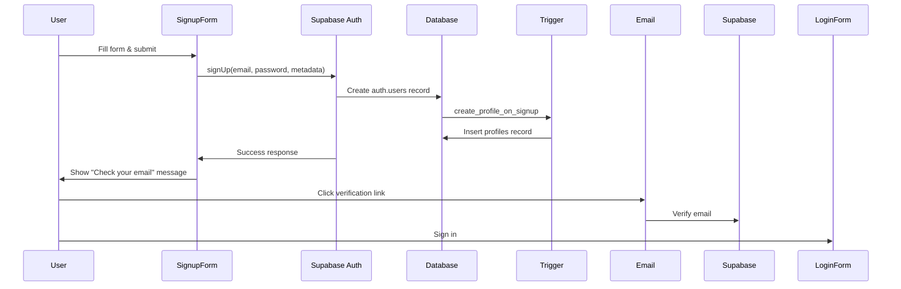
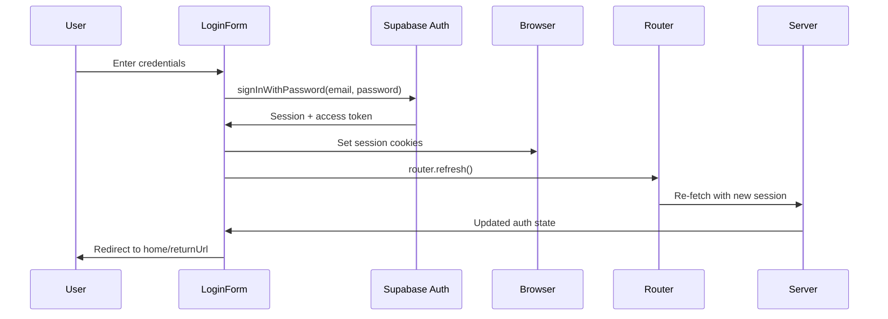
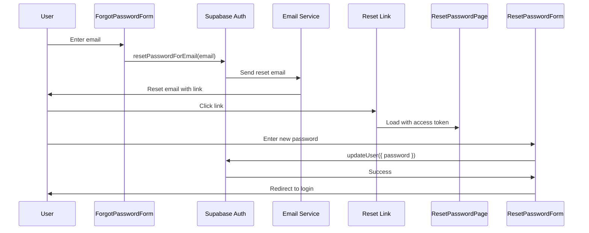
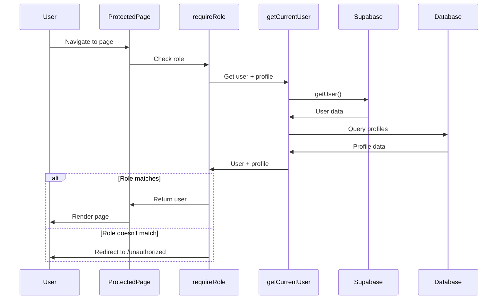

# Unit 6: Authentication Flow

## Overview

This unit implements the complete authentication system using **Supabase Auth**, providing user registration, login, password reset, and role-based access control. The implementation integrates seamlessly with the database schema (Unit 1), TypeScript types (Unit 2), and API routes (Unit 4).

**Key Features:**

- Email/password authentication via Supabase Auth
- Automatic profile creation (database trigger)
- Role-based access control (attendee, organizer, staff, admin)
- Password reset flow
- Session management via middleware
- Server-side and client-side authentication helpers
- Protected routes and pages
- User navigation menu

---

## Architecture

### Authentication Stack

1. **Supabase Auth** - Backend authentication service
   - Email/password authentication
   - Session management with JWTs
   - Email verification and password reset
   - Secure token storage

2. **Database Trigger** - Auto-create profile
   - Triggers on `auth.users` insert
   - Creates `profiles` record with user metadata
   - Sets initial role from signup metadata

3. **Middleware** - Session refresh
   - Validates and refreshes auth tokens
   - Runs on every request
   - Updates session cookies

4. **Helper Functions** - Authorization utilities
   - `getCurrentUser()` - Get authenticated user + profile
   - `requireAuth()` - Enforce authentication (with redirect)
   - `requireRole()` - Enforce role-based access

---

## Files Created

### Authentication Components (5 files)

#### 1. LoginForm Component

**File:** `src/components/auth/LoginForm.tsx` (~140 lines)

**Purpose:** User login form with email/password

**Features:**

- Email and password input fields
- Client-side validation (required fields, password min length)
- Supabase `signInWithPassword()` integration
- Error handling and display
- Return URL support (redirect after login)
- Link to signup and forgot password
- Loading state during submission

**Key Implementation:**

```typescript
"use client";

const handleSubmit = async (e: React.FormEvent) => {
  e.preventDefault();
  setIsLoading(true);

  const supabase = createBrowserClient();

  const { data, error } = await supabase.auth.signInWithPassword({
    email,
    password,
  });

  if (error) {
    setError(error.message);
    return;
  }

  router.refresh(); // Refresh server components
  router.push(returnUrl || "/");
};
```

**Usage:**

```typescript
<LoginForm />
```

---

#### 2. SignupForm Component

**File:** `src/components/auth/SignupForm.tsx` (~270 lines)

**Purpose:** User registration form

**Features:**

- Full name, email, password, confirm password fields
- Role selection (attendee or organizer)
- Client-side validation:
  - Password min 6 characters
  - Passwords match
  - Full name min 2 characters
- Supabase `signUp()` integration
- User metadata passed to profile trigger
- Success message after registration
- Email verification instructions
- Link to login

**Form Data:**

```typescript
interface SignupFormData {
  email: string;
  password: string;
  confirmPassword: string;
  fullName: string;
  role: "attendee" | "organizer";
}
```

**Key Implementation:**

```typescript
const { data, error } = await supabase.auth.signUp({
  email: formData.email,
  password: formData.password,
  options: {
    data: {
      full_name: formData.fullName,
      role: formData.role,
    },
  },
});
```

**Profile Creation:**

- Database trigger `create_profile_on_signup` automatically creates profile
- Uses `auth.uid()` to link to user
- Copies `full_name` and `role` from metadata

---

#### 3. ForgotPasswordForm Component

**File:** `src/components/auth/ForgotPasswordForm.tsx` (~120 lines)

**Purpose:** Request password reset email

**Features:**

- Email input field
- Supabase `resetPasswordForEmail()` integration
- Success message after email sent
- Redirect URL for reset link
- Link back to login

**Key Implementation:**

```typescript
const { error } = await supabase.auth.resetPasswordForEmail(email, {
  redirectTo: `${window.location.origin}/auth/reset-password`,
});
```

**Email Flow:**

1. User enters email
2. Supabase sends reset email
3. User clicks link in email
4. Redirected to `/auth/reset-password` with access token
5. User sets new password

---

#### 4. ResetPasswordForm Component

**File:** `src/components/auth/ResetPasswordForm.tsx` (~145 lines)

**Purpose:** Set new password after email verification

**Features:**

- New password and confirm password fields
- Client-side validation (passwords match, min 6 chars)
- Supabase `updateUser()` integration
- Success message and redirect to login
- Link back to login

**Key Implementation:**

```typescript
const { error } = await supabase.auth.updateUser({
  password: password,
});

// Redirect after 2 seconds
setTimeout(() => {
  router.push("/auth/login");
}, 2000);
```

**Note:** User arrives at this page with an access token in the URL (from email link), so they're already "authenticated" for password update purposes.

---

#### 5. UserMenu Component

**File:** `src/components/auth/UserMenu.tsx` (~170 lines)

**Purpose:** Dropdown menu for authenticated users

**Features:**

- User avatar with initials
- Dropdown toggle button
- User info display (name, email, role)
- Role-based navigation links:
  - All users: "My Tickets"
  - Organizers: "My Events", "Create Event"
  - Staff: "Staff Dashboard"
  - Admin: "Admin Panel"
- Sign out button
- Click-outside to close

**Props:**

```typescript
interface UserMenuProps {
  user: {
    id: string;
    email: string;
  };
  profile: Profile;
}
```

**Key Implementation:**

```typescript
const handleSignOut = async () => {
  const supabase = createBrowserClient();
  await supabase.auth.signOut();
  router.refresh();
  router.push("/");
};
```

---

### Navigation Component (1 file)

#### 6. Navigation Component

**File:** `src/components/auth/Navigation.tsx` (~100 lines)

**Purpose:** Main navigation bar with auth state

**Features:**

- Server-side component (fetches auth state on server)
- Logo and brand
- Main navigation links
- Conditional rendering based on auth state:
  - Not logged in: "Sign In" and "Sign Up" buttons
  - Logged in: UserMenu component
- Role-based links (e.g., "Create Event" for organizers)

**Server-Side Auth Check:**

```typescript
export async function Navigation() {
  const supabase = createServerClient();

  const { data: { user } } = await supabase.auth.getUser();

  let profile = null;
  if (user) {
    const { data } = await supabase
      .from('profiles')
      .select('*')
      .eq('id', user.id)
      .single();
    profile = data;
  }

  return (
    <nav>
      {/* ... */}
      {user && profile ? (
        <UserMenu user={user} profile={profile} />
      ) : (
        <div>
          <Link href="/auth/login">Sign In</Link>
          <Link href="/auth/signup">Sign Up</Link>
        </div>
      )}
    </nav>
  );
}
```

---

### Authentication Utilities (1 file)

#### 7. Auth Helpers

**File:** `src/lib/auth/helpers.ts` (~110 lines)

**Purpose:** Reusable server-side authentication utilities

**Functions:**

**1. getCurrentUser()**

```typescript
async function getCurrentUser(): Promise<{
  user: { id: string; email: string };
  profile: Profile;
} | null>;
```

- Fetches current authenticated user from server
- Fetches associated profile
- Returns null if not authenticated
- Used for conditional rendering and authorization checks

**2. requireAuth()**

```typescript
async function requireAuth(returnUrl?: string): Promise<{
  user: { id: string; email: string };
  profile: Profile;
}>;
```

- Enforces user authentication
- Redirects to login if not authenticated
- Optionally accepts return URL
- Used in protected pages

**Usage in protected page:**

```typescript
export default async function MyTicketsPage() {
  const { user, profile } = await requireAuth("/my/registrations");

  // User is guaranteed to be authenticated
  // ...
}
```

**3. requireRole()**

```typescript
async function requireRole(
  allowedRoles: UserRole[],
  returnUrl?: string,
): Promise<{
  user: { id: string; email: string };
  profile: Profile;
}>;
```

- Enforces role-based access control
- Redirects to `/unauthorized` if role doesn't match
- Used for admin-only or organizer-only pages

**Usage in role-protected page:**

```typescript
export default async function AdminPage() {
  const { user, profile } = await requireRole(["admin"]);

  // User is guaranteed to be admin
  // ...
}
```

**4. Helper Functions (without redirect)**

- `isAuthenticated(): Promise<boolean>`
- `hasRole(role: UserRole): Promise<boolean>`
- `hasAnyRole(roles: UserRole[]): Promise<boolean>`

---

### Authentication Pages (5 files)

#### 8. Login Page

**File:** `src/app/auth/login/page.tsx` (~55 lines)

**Features:**

- Renders LoginForm component
- Server-side redirect if already logged in
- "Back to Home" link
- Centered layout

#### 9. Signup Page

**File:** `src/app/auth/signup/page.tsx` (~55 lines)

**Features:**

- Renders SignupForm component
- Server-side redirect if already logged in
- "Back to Home" link
- Centered layout

#### 10. Forgot Password Page

**File:** `src/app/auth/forgot-password/page.tsx` (~45 lines)

**Features:**

- Renders ForgotPasswordForm component
- "Back to Sign In" link
- Centered layout

#### 11. Reset Password Page

**File:** `src/app/auth/reset-password/page.tsx` (~45 lines)

**Features:**

- Renders ResetPasswordForm component
- "Back to Sign In" link
- Centered layout

#### 12. Unauthorized Page

**File:** `src/app/unauthorized/page.tsx` (~60 lines)

**Features:**

- Error icon
- "Access Denied" message
- Explanation text
- "Go to Home" button
- "Sign in with a different account" link

---

## Authentication Flows

### 1. Registration Flow



**Steps:**

1. User fills signup form (email, password, full name, role)
2. Client calls `supabase.auth.signUp()` with metadata
3. Supabase creates `auth.users` record
4. Database trigger `create_profile_on_signup` fires
5. Trigger creates `profiles` record with user data
6. Supabase sends verification email (if enabled)
7. User verifies email and signs in

---

### 2. Login Flow



**Steps:**

1. User enters email and password
2. Client calls `supabase.auth.signInWithPassword()`
3. Supabase validates credentials
4. Returns session with access token and refresh token
5. Tokens stored in cookies (via middleware)
6. Router refreshes to update server components
7. User redirected to intended page

---

### 3. Password Reset Flow



**Steps:**

1. User requests password reset with email
2. Supabase sends reset email with link
3. Link contains access token and redirects to `/auth/reset-password`
4. User enters new password
5. Client calls `supabase.auth.updateUser({ password })`
6. Password updated
7. User redirected to login

---

### 4. Authorization Flow (requireRole)



**Steps:**

1. User navigates to protected page
2. Page calls `requireRole(['admin'])`
3. Helper fetches user and profile
4. Checks if user.role is in allowedRoles
5. If yes: Returns user data, page renders
6. If no: Redirects to `/unauthorized`

---

## Integration with Existing Units

### Unit 1: Database Schema

**Profile Creation:**

- Signup form passes `full_name` and `role` in user metadata
- Database trigger `create_profile_on_signup` reads metadata:
  ```sql
  INSERT INTO profiles (id, email, full_name, role)
  VALUES (
    NEW.id,
    NEW.email,
    NEW.raw_user_meta_data->>'full_name',
    COALESCE(NEW.raw_user_meta_data->>'role', 'attendee')::user_role
  );
  ```

**RLS Policies:**

- Authentication integrated with RLS policies
- `auth.uid()` used to identify current user
- Policies enforce ownership and role-based access

---

### Unit 2: Supabase Clients

**Server Client:**

- Used in Navigation component
- Used in auth helper functions
- Accesses session from cookies

**Browser Client:**

- Used in all auth forms
- Manages session in browser
- Updates cookies automatically

**Middleware:**

- Refreshes session on every request
- Keeps auth tokens up to date
- Updates response cookies

---

### Unit 4: API Routes

**Authentication in API Routes:**

Before (manual auth check):

```typescript
export async function POST(request: Request) {
  const supabase = createServerClient();
  const {
    data: { user },
  } = await supabase.auth.getUser();

  if (!user) {
    return createErrorResponse(new UnauthorizedError());
  }
  // ...
}
```

After (using helpers):

```typescript
import { getCurrentUser } from "@/lib/auth/helpers";

export async function POST(request: Request) {
  const currentUser = await getCurrentUser();

  if (!currentUser) {
    return createErrorResponse(new UnauthorizedError());
  }
  // ...
}
```

---

## Security Considerations

### Password Security

- Minimum 6 characters (can be increased)
- Supabase hashes passwords with bcrypt
- Passwords never stored in plain text
- Password reset requires email verification

### Session Management

- JWTs for authentication
- Short-lived access tokens (1 hour default)
- Long-lived refresh tokens (30 days default)
- Automatic token refresh via middleware
- Secure, httpOnly cookies

### CSRF Protection

- Supabase handles CSRF tokens
- Cookies include SameSite attribute
- State parameter in OAuth flows

### XSS Protection

- All user input sanitized
- React escapes output by default
- No `dangerouslySetInnerHTML` in auth components

### Role-Based Access

- Roles enforced on server (not client)
- Helper functions check role before rendering
- API routes validate role before executing commands
- Database RLS as final layer

---

## Environment Variables

Required in `.env.local`:

```bash
# Supabase Configuration
NEXT_PUBLIC_SUPABASE_URL=https://your-project.supabase.co
NEXT_PUBLIC_SUPABASE_ANON_KEY=your-anon-key
SUPABASE_SERVICE_ROLE_KEY=your-service-key

# App URL (for email redirects)
NEXT_PUBLIC_APP_URL=http://localhost:3000
```

**Production:**

- Update `NEXT_PUBLIC_APP_URL` to production domain
- Enable email confirmation in Supabase dashboard
- Configure email templates

---

## Supabase Configuration

### Email Templates

Customize in Supabase Dashboard → Authentication → Email Templates:

1. **Confirm Signup**
   - Subject: "Confirm your email"
   - Link: `{{ .ConfirmationURL }}`

2. **Reset Password**
   - Subject: "Reset your password"
   - Link: `{{ .ConfirmationURL }}`

3. **Magic Link** (optional)
   - Subject: "Your magic link"
   - Link: `{{ .ConfirmationURL }}`

### Auth Settings

Recommended configuration:

- **Email Confirmations:** Enabled (production)
- **Secure Password Change:** Enabled
- **Session Timeout:** 3600 seconds (1 hour)
- **Refresh Token Lifetime:** 2592000 seconds (30 days)
- **JWT Expiry:** 3600 seconds
- **Site URL:** `https://yourdomain.com`
- **Redirect URLs:**
  - `https://yourdomain.com/auth/reset-password`
  - `http://localhost:3000/auth/reset-password` (dev)

---

## Testing Authentication

### Manual Testing Checklist

**Registration:**

- [ ] Register with valid email/password
- [ ] Profile created automatically
- [ ] Correct role assigned
- [ ] Email verification sent (if enabled)
- [ ] Error on duplicate email
- [ ] Error on weak password
- [ ] Error on password mismatch

**Login:**

- [ ] Login with valid credentials
- [ ] Session persists on refresh
- [ ] Redirect to return URL works
- [ ] Error on invalid credentials
- [ ] Error on unverified email (if required)

**Password Reset:**

- [ ] Request reset email
- [ ] Email received with link
- [ ] Link loads reset page
- [ ] New password set successfully
- [ ] Can login with new password
- [ ] Error on invalid email
- [ ] Error on password mismatch

**Authorization:**

- [ ] requireAuth() redirects unauthenticated users
- [ ] requireRole() redirects users without permission
- [ ] Protected pages inaccessible when logged out
- [ ] Role-specific links show/hide correctly

**Session Management:**

- [ ] Session refreshes automatically
- [ ] Logout clears session
- [ ] Logged out users can't access protected routes
- [ ] Session persists across tabs

---

## Usage Examples

### Protected Page (Server Component)

```typescript
// src/app/my/tickets/page.tsx
import { requireAuth } from '@/lib/auth/helpers';

export default async function MyTicketsPage() {
  const { user, profile } = await requireAuth('/my/tickets');

  // Fetch user's tickets
  const tickets = await fetchUserTickets(user.id);

  return (
    <div>
      <h1>My Tickets</h1>
      <p>Welcome, {profile.full_name}!</p>
      {/* Render tickets */}
    </div>
  );
}
```

### Role-Protected Page

```typescript
// src/app/organizer/events/page.tsx
import { requireRole } from '@/lib/auth/helpers';

export default async function OrganizerEventsPage() {
  const { user, profile } = await requireRole(['organizer', 'admin']);

  // Fetch organizer's events
  const events = await fetchOrganizerEvents(user.id);

  return (
    <div>
      <h1>My Events</h1>
      {/* Render events */}
    </div>
  );
}
```

### Conditional Rendering (Server Component)

```typescript
// src/app/page.tsx
import { getCurrentUser } from '@/lib/auth/helpers';

export default async function HomePage() {
  const currentUser = await getCurrentUser();

  return (
    <div>
      {currentUser ? (
        <p>Welcome back, {currentUser.profile.full_name}!</p>
      ) : (
        <p>Welcome! Please sign in.</p>
      )}
    </div>
  );
}
```

### API Route with Auth

```typescript
// src/app/api/events/create/route.ts
import { getCurrentUser } from "@/lib/auth/helpers";

export async function POST(request: Request) {
  const currentUser = await getCurrentUser();

  if (!currentUser) {
    return createErrorResponse(new UnauthorizedError());
  }

  if (!["organizer", "admin"].includes(currentUser.profile.role)) {
    return createErrorResponse(new ForbiddenError());
  }

  // Create event...
}
```

---

## Troubleshooting

### Common Issues

**1. "User not found" error**

- Check if profile was created in database
- Verify database trigger is enabled
- Check Supabase logs for errors

**2. Session not persisting**

- Verify middleware is running
- Check cookie settings (httpOnly, secure, sameSite)
- Clear browser cookies and try again

**3. Redirect loop on protected pages**

- Check if requireAuth is called multiple times
- Verify return URL encoding
- Check middleware configuration

**4. Email not received**

- Check spam folder
- Verify SMTP settings in Supabase
- Check email template configuration
- Test with different email provider

**5. "Access denied" on allowed role**

- Verify profile.role in database
- Check role passed to requireRole()
- Ensure role is in allowed_roles array

---

## Summary

**Unit 6: Authentication Flow** provides a complete, production-ready authentication system:

**Components Created:**

1. ✅ LoginForm - Email/password login
2. ✅ SignupForm - User registration with role selection
3. ✅ ForgotPasswordForm - Password reset request
4. ✅ ResetPasswordForm - Set new password
5. ✅ UserMenu - Dropdown with user info and navigation
6. ✅ Navigation - Main nav bar with auth state

**Utilities Created:** 7. ✅ Auth Helpers - getCurrentUser, requireAuth, requireRole

**Pages Created:** 8. ✅ Login Page - /auth/login 9. ✅ Signup Page - /auth/signup 10. ✅ Forgot Password Page - /auth/forgot-password 11. ✅ Reset Password Page - /auth/reset-password 12. ✅ Unauthorized Page - /unauthorized

**Total Lines of Code:** ~1,300 lines

**Key Features:**

- Supabase Auth integration
- Automatic profile creation
- Role-based access control
- Password reset flow
- Session management
- Server and client auth helpers
- Protected routes
- User navigation

**Next Steps:**

- **Unit 7:** Page Routes (Complete Next.js App Router pages)
- **Unit 8:** Email Templates (Event notifications)
- **Unit 9:** Testing (Unit, integration, E2E)
- **Unit 10:** Deployment (Production setup)

This unit integrates seamlessly with the database (Unit 1), types (Unit 2), and API routes (Unit 4), providing the authentication foundation for all user-facing features.
